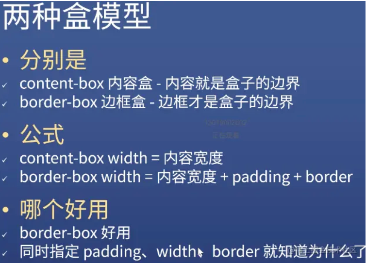

### CSS使用指南

#### 引入

| 引入方式 | 内容                                       | 备注       |
| -------- | ------------------------------------------ | ---------- |
| 行内样式 | 直接在元素上,加`style`属性                 | 优先级最高 |
| 内部样式 | 使用`<style>`标签                          |            |
| 外部样式 | 用`<head>`标签内的`<link>`标签引入样式文件 |            |

#### 语法

CSS语法是由_**选择器**_和_**声明**_组成的

| 选择器分类 |                             内容                             |                             备注                             |
| :--------: | :----------------------------------------------------------: | :----------------------------------------------------------: |
| 全局选择器 |                   可与任何元素匹配;初始化                    |                          优先级最低                          |
| 基础选择器 | 元素选择器 类选择器(对应元素的class属性,用.) id选择器(对应元素的id属性,用#) 通配符选择器 |                                                              |
| 关系选择器 | 后代选择器:选择所有被祖先元素包含的_后代元素_ 子代选择器:选择所有被祖先元素包含的_直接子元素_ 相邻兄弟选择器:选择紧跟E元素后的F元素,相邻的第一个兄弟元素 通用兄弟选择器:选择E元素之后的所有兄弟元素F | 后代E F{} 子代E>F{} 相邻兄弟 E+F{} 通用兄弟 E~F{} |

#### 盒模型

* 盒模型可以想象为一个盒子里装了content,这content跟盒子边框的距离就是padding,盒子的厚度就是border,盒子的外边距就是margin.

| name                                  | 公式                          | 使用         |
| ------------------------------------- | ----------------------------- | ------------ |
| content-box 内容盒-内容就是盒子的边界 | content-box width=内容宽度    | 一般不使用   |
| border-box 边框盒-边框才是盒子的边界  | width=内容宽度+padding+border | 一般默认使用 |

* `box-sizing: content-box`

#### CSS定位

##### 相对定位

* 用作位移,占位置但是有偏移

* 用作给`position:absolute`元素做爸爸

* 配合`z-index`

  `每个元素的z-index属性默认为auto,计算出的值为0,值大的在上面,小的在下面,可以为负数`

##### 绝对定位

脱离原来的位置,另起一层.

absolute是相对于其祖元素第一个不是`position:static`定位的(一般是子绝父相)

##### 固定定位

一般用于广告页、回到顶部按钮等

