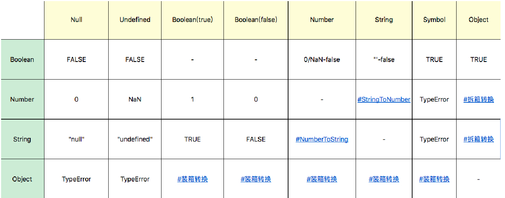
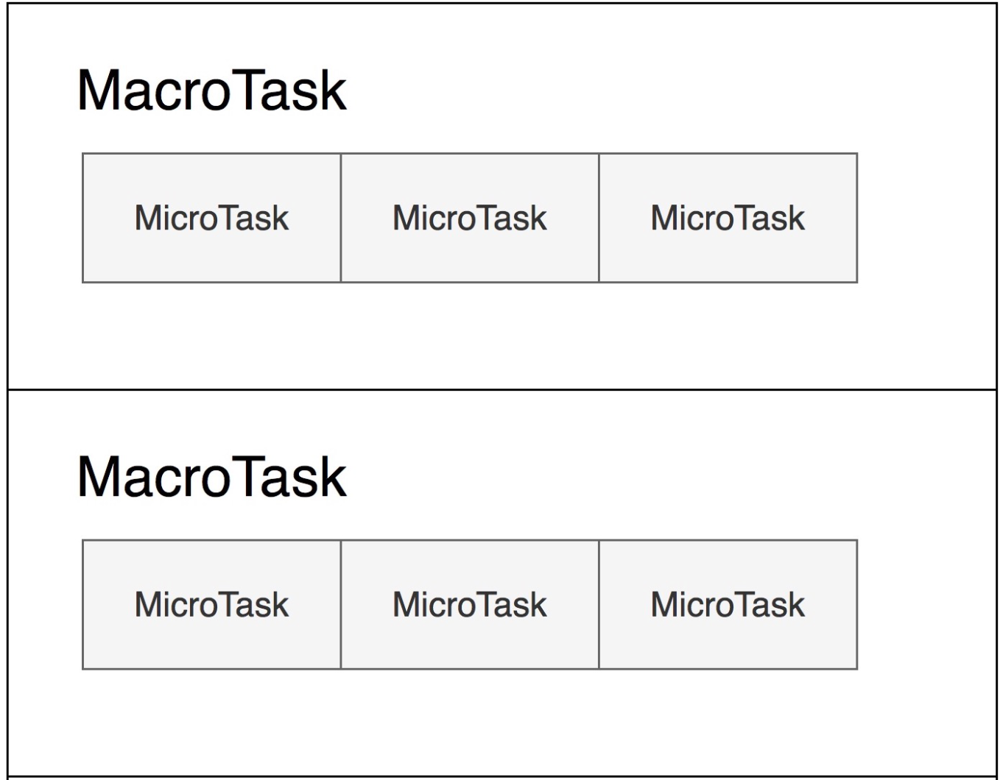

#### 类型

##### Undefined和Null

* 为什么用void 0 来获取undefined的值?

  这是因为undefined被定义为了一个类型而非关键字,换句话说undefined这个词可以赋值成其它的含义.

* undefined和null的区别?

  null是表示:"定义了但是为空".

  null是JavaScript的关键字,所以可以放心使用关键字来获取null值.

##### Number

NaN占用了9007199254740990，这原本是符合 IEEE 规则的数字；
Infinity，无穷大,-Infinity，负无穷大(不让除以 0 出错，而引入了无穷大的概念比如不让除以 0 出错，而引入了无穷大的概念)

JavaScript中有-0跟+0,在加法类运算中没有什么区别,但是除法的场合要留意区分,"忘记检测除以-0而得到负无穷大"的情况经常会导致错误,区别的方法就是检测1/x是Infinity还是-Infinity.

Number类型中有效的整数范围是-0x1fffffffffffff 至 0x1fffffffffffff，所以 Number 无法精确表示此范围外的整数。

同样根据浮点数的定义,非整数的Number类型无法用==`(===也不行)`来比较,0.1+0.2不能=0.3

```
Math.abs(0.1 + 0.2 - 0.3) <= Number.EPSILON // 可以用这种方式判断,绝对值是否小于最小精度
```

##### Object

JavaScript中的几个基本类型都在对象类型中有一个"亲戚",它们是:Number,String,Boolean,Symbol.

我们必须要认识到3与new Number(3)是完全不同的值,它们一个是Number类型,一个是对象类型.

Number、String和Boolean，三个构造器是两用的，当跟new搭配是，它们是对象，当直接调用时，它们表示强制类型转换。Symbol 函数比较特殊，直接用 new 调用它会抛出错误，但它仍然是 Symbol 对象的构造器。

JavaScript语言设计上试图模糊对象和基本类型之间的关系,我们日常代码可以把对象的方法在基本类型上使用,例如:`console.log("abc".chatAt(0));	// a`
甚至我们在原型上添加方法,都可以应用于基本类型,比如一下代码,在Symbol原型上添加了hello方法,在任何Symbol类型变量都可以调用.

```javascript
Symbol.prototype.hello = () => console.log("hello");
var a = Symbol("a");
console.log(typeof a);	// symbol, a 并非对象
a.hello();	// hello,有效
```

为什么给对象添加的方法能用在基本类型上？

运算符提供了装箱操作,它会根据基础类型构造一个临时对象,使得我们能在基础类型上调用对应的对象方法.

##### 类型转换



##### 装箱操作

所谓的装箱转换,正是把基本类型转换为对应的对象,它是类型转换中一种相当重要的种类.

装箱机制会频繁的产生临时对象,在一些对性能要求较高的场景下,我们应该尽量避免对基本类型做装箱转换.

使用内置的Object函数,我们可以在JavaScript代码中显式调用装箱能力.

```javascript
var symbolObject = Object(Symbol('a'));
console.log(typeof symbolObject);	// object
console.log(symbolObject instanceof Symbol); //true
console.log(symbolObject.constructor == Symbol); //true
```

每一类装箱对象皆有私有的Class属性,这些属性可以用Object.prototype.toSting获取:

```javascript
var symbolObject = Object(Symbol("a")); 
console.log(Object.prototype.toString.call(symbolObject)); //[object Symbol]
```

在JavaScript中,没有任何方法可以更改私有的Class属性,因此Object.prototype.toString是可以准确识别对象对应的基本类型的方法,它比instanceof更加准确.

但需要注意的是,call本身会产生装箱操作,所以需要配合typeof来区分基本类型还是对象类型.

#### JavaScript的原型

原型系统可以说相当简单,可以用两条概括:
	如果所有对象都有私有字段[[prototype]],就是对象的原型;
	读一个属性,如果对象本身没有,则会继续访问对象的原型,直到原型为空或者找到为止.

JavaScript提供了三个内置函数,以便直接地访问操纵原型:

```javascript
Object.create // 根据指定的原型创建新对象,原型可以是null;
Object.getPrototypeOf // 获得一个对象的原型;
Object.setPrototypeOf	// 设置一个对象的原型;
```

#### ES6中的类

ES6中加入了新特性class关键字,并且在标准中删除了所有[[class]]相关的私有属性描述.

```javascript
class Animal { 
 constructor(name) {
 this.name = name;
 }
 speak() {
 	console.log(this.name + ' makes a noise.');
 }
}
class Dog extends Animal {
 constructor(name) {
 	super(name); // call the super class constructor and pass in the name parameter
 }
 speak() {	// 直接覆盖super class(父类)的speak方法
 	console.log(this.name + ' barks.');
 }
}
let d = new Dog('Mitzie');
d.speak(); // Mitzie barks.
```

#### JavaScript执行

##### Promise里的代码为什么比setTimeout先执行?

这里引入一个概念,宏观任务跟微观任务.
我们把宿主(例如浏览器)发起的任务称为宏观任务,把JavaScript引擎发起的任务称为微观任务.

大致可以理解为宏观任务是在时间循环中执行的,微观任务是在宏观任务中执行的,也就是说事件循环执行一个宏观任务队列,每个宏观任务又可以执行一个微观任务队列.

Promise是JavaScript的提供的异步方法,也就是说调用时会创建一个微观任务,而setTimeout是浏览器(宿主)API,它产生宏观任务



也就是说下个宏观任务是需要上个宏观任务的微观任务执行完成之后再执行?
微任务始终先于宏任务

```javascript
setTimeout(()=>console.log("d"), 0)
 var r = new Promise(function(resolve, reject){
 resolve()
 });
 r.then(() => { 
 var begin = Date.now();
 while(Date.now() - begin < 1000);
 console.log("c1") 
 new Promise(function(resolve, reject){
 resolve()
 }).then(() => console.log("c2"))
 });
```

上面这段代码,无论Promise设置的等多久,都是等Promise执行完成后再执行setTimeout的,打印顺序永远是`c1 c2 d`

##### 为什么12.toString()会报错

十进制的Number可以带小数,小数点前后部分都可以省略,但是不能同时省略.

`12.toString()`这时候`12.`会被当做省略了小数点后面部分的数字而看成一个整体,如果想让点单独成为一个token就要加入空格.

```JavaScript
.01
12.
12.01
12 .toString();
```

##### 脚本和模块

JavaScript有两种源文件,一种叫做脚本,一种叫做模块.(这区分是在ES6引入之后,之前之后脚本)

脚本是可以由浏览器或者node环境引入执行的,而模块只能由JavaScript代码用import引入执行.

实际上模块跟脚本之间的区别仅仅在于是否包含import和export(模块包含).

现代浏览器可以支持用script标签引入模块或者脚本,如果要引入模块必须给script标签添加type="module".如果引入脚本,则不需要.

```JavaScript
import "mod"; // 引入一个模块
import v from "mod"; // 把模块默认的导出值放入变量 v
```

直接import一个模块只是保证了这个模块代码被执行,引用它的模块是无法获得它的任何信息的.

带from的impor意思是引入模块中的一部分信息,可以把它们变成本地的变量.

带from的import细分又有三种用法:

```JavaScript
import x from "./a.js" 引入模块中导出的默认值。
import {a as x, modify} from "./a.js"; 引入模块中的变量。
import * as x from "./a.js" 把模块中所有的变量以类似对象属性的方式引入。
// 第一种方式还可以跟后两种组合使用
import d, {a as x, modify} from "./a.js"
import d, * as x from "./a.js"
// 语法要求不带 as 的默认值永远在最前。
```

###### export声明

模块中导出变量的方式有两种,一种是独立使用export声明,另一种是直接在声明型语句前添加export关键字.

独立使用export声明就是一个export关键字加上变量名列表:

```JavaScript\
export {a, b, c}		
```

我们也可以直接在声明型语句前添加export关键字,这里的export可以加在任何声明性质语句之前:

```JavaScript
var
function(包含async和generator)
class
let
const
```

export还有一种特殊用法,就是跟default联合使用.export default 表示导出一个默认变量值，它可以用于 function 和 class。这里导出的变量是没有名称的，可以使用
import x from "./a.js"这样的语法，在模块中引入。

export default 还支持一种语法，后面跟一个表达式，例如：

```JavaScript
var a = {};
export default a;
```

但是，这里的行为跟导出变量是不一致的，这里导出的是值，导出的就是普通变量 a 的值，以后 a 的变化与导出的值就无关了，修改变量 a，不会使得其他模块中引入的 default值发生改变。

##### 预处理

var 的作用能够穿透一切语句结构，它只认脚本、模块和函数体三种语法结构。

```JavaScript
var a = 1;
function foo() {
 console.log(a);	// undefined
 if(false) {
 var a = 2;
 }
}
foo();
```

##### with

with 语句把对象的属性在它内部的作用域内变成变量.

```javascript
let o = {a:1, b:2}
with(o){
 console.log(a, b);
}
```

#### ES6新特性

##### 数组的结构

```javascript
let arr = [1,2,3];
let [foo, doo, poo = "222", goo = "6"] = arr;	// 可以设置默认值
console.log(doo);	// 2
let[a,...b]=arr;
console.log(b);	// [2,3]
```

##### 对象的结构

```JavaScript
const person = { name: 'tom', age: 16 }
const { name } = person;
const { log } = console;
log(name);
const { name: personName = "jj", sex = 'undefined' } = person	// 可以重命名,解决变量重名冲突问题,也可以给默认值,如果取不到就用默认值的值
log(personName)
log(sex)
```


