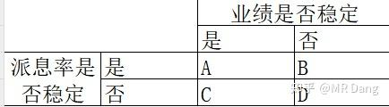

***

title: Mr Dang投资心得
date: 2026-04-23 15:19:14
tags:
-----

## 仓位控制

- 第一点就是要选择标的，不要选相同行业或者上下游的。
- 新手不知道咋选就选股息率高的股票。
- 比如说你要60%的仓位，分三只股票，每只股票20%的仓位，空40%的仓位。每股留下10%的仓位，股价每下跌5%就加1%的仓位。都加满了还剩下10%就是选股息率最高的给梭哈进去。
- 卖的话就建议30%盈利就卖出，因为如果是5%的股息率股价上涨30%后股息率就不到4%了，针对2025年10月的无风险利率而言来说就食之无味了。
  为啥要选股息率高的呢，寒冬来临的时候是实打实的给你分红，你可以用分红的钱继续投资，如果你当初买的是10块的股票，预期派息5毛钱。跌了50%，还剩5块，再分5毛，除权就是4.5。你的5毛就可以增加11%的股份。股价涨回9块就解套了。你1分钱没出，只是因为股息的复投，就把成本降到了9块。

## 分红和除权

### 分红

1.分红的意义是什么？
分红的意义就是可以稳定有水喝。
2.我为什么不在分红前把股票给卖掉？
因为我要的是喝水而不是卖水杯。

#### 那投资者应该考虑的是什么呢？

1.公司往杯子里倒水的速度如何？（创造利润的能力）
2.公司允许你多长时间喝一次水？一次喝多少？（分红的力度）

### 除权

一般什么情况下除权呢？
答：分红和送股
怎么除权呢？
1.分红就是直接减。
比如15块的股票，10派3，相当于一股0.3，那就是15-0.3=14.7。
2.送股就是直接除。
比如15块的股票，10送10，相当于一股变两股，那就是15/2=7.5。
3.稍微难点的是分红+送股
那就先减后除。
比如15块的股票，10派3，10送10，相当于一股0.3，15-0.3=14.7，14.7/2=7.35。

#### 复权

1.前复权就是以现在的股价为基准，对之前的走势进行复权。
2.后复权就是以上市的价格为基准价，然后进行复权的过程。要看真实收益情况，看后复权！

止盈的逻辑：
每次止盈都是为了更高的股息率，永远在寻找当前情况下预期股息率最高的配置。我买的东西短时期内涨了30%一定会导致股息率明显下降。这个时候再切换到股息率高的东西，预期股息就会进一步增加，把雪球滚起来。

## 测算股息率

**我们要算的是预期股息率，而不是什么过去的股息率。**
#### 一：分类
在测算预期股息率的时候，先把公司分类一下：

这里有个词叫`派息率`，什么意思呢?公司挣了100块，分给股东30块，就是30%派息率。
我建议大家搞价值投资的时候，最好买A类企业，如果便宜，也可以买B类和C类，但是尽量不要买D类企业。
A类企业代表：银行，公用事业（水电，气，部分油），电信，铁路（大秦铁路），茅台等。
B类企业代表：海运，除茅台外白酒消费，煤，有色，化工等。
C类企业代表：火电，部分油，水务，燃气，纺织，家电，高铁等。
D类企业代表：投资新手不要碰，怕你把握不住。
通常A类的平均股息率会低一些，因为确定性强。
B和C类的平均股息率会高一些，因为确定性不够，要用股息率作为补偿。
如果你发现一个A类企业，股息率还高，请不要犹豫，先买了再说。
#### 二：测算基准
A类：算出最近两年的平均派息率并测算业绩。
以`招商银行`为例:2023年33.92%，2024年33.99%。平均大约33.95%。
业绩你预测不了就按照前三季度来，同比基本没变，那你预测去年的5.66没大的毛病，今年银行整体差一些，你再留个余量，按照5.6算就行了。
5.6*0.3395=1.9
1.9/41.2=4.61%
B类:
以`中远海控`为例：2023年49.74%，2024年49.4%，平均大约49.6%。
业绩你自己不要算了，普通投资者总不能天天盯着SCFI和油价算业绩，前三季度1.74，`中远海控`一般第四季度业绩都一般，随便猜一个数字，按照0.3算就行，全年2.04
2.04*0.496=1.01
1.01/14.88=6.8%
C类：
以`华电国际`为例：2023年33.93%，2024年39.21%，平均大约36.57%
业绩一致性预期是0.6
0.6*0.3657=0.22
0.22/5.53=4%
#### 三：行业基准纠正
距离价值投资者还差一步，就是第三步的行业基准纠正，这是精髓所在。
怎么纠正呢？
A类：
A类企业为什么分红稳定？
因为它盈利能力稳，处于成熟期，又有健全的制度。
每年就是赚钱，然后开会，然后分红，惯性很强。
所以一般不需要纠正，除非有外力。
比如考核目标，比如管理层表态。
你需要去揣摩管理层公开的文字表达。
B类：
B类企业派息率稳定，但是为什么业绩不稳定？
说明公司治理非常现代化，利润的现金流很充足，但是所在的行业周期性太强。
这类企业有个特点，他会有周期焦虑。
什么意思呢，就是如果业绩不好的时候分50%，突然有一年大周期来了，他的派息率大概率是低于50%的，公司会倾向于屯一些现金，到周期底部的时候释放分红，平滑周期波动。
你在上面测算的基础上，就要根据周期情况进行合理的基准纠正，周期顶部的时候下调一点派息率，周期底部反而可以上调一点预期。
当然这只是一种经验，具体标的还要具体分析。
C类：
C类企业业绩稳定，为什么分红不稳定？这类企业一般会根据需要有大额资本开支，比如要建设新的产能，或者提前囤积原料，或者并购，或者投资。
你如果在公告里看见它又要收购XX，又要在XX哪里巨额投资，那你就要下调派息比例了。
相反，如果它天降横财，出售了XX业务，或者把持有XX股票处理了，那大概率就要分红了，可以适当上调派息比例。
#### 四：大股东需求纠正
第三步完了之后，还需要考虑大股东的诉求。因为大股东的诉求重要性更高，所以放在第四步，去纠正第三步的结果。
如果大股东急需用钱，但是又没有减持股票，很可能通过加大派息率来达到目的。
有些股东不是大股东，但是属于重要的财务投资者，在投资的时候和大股东或者公司都是有约定的，也要提高派息率的预期。
#### 五：公告纠正
这步的确定性是最高的，很多公司为了安抚投资者，推出了很多提振派息的公告，所以放在最后一步进行纠正。
