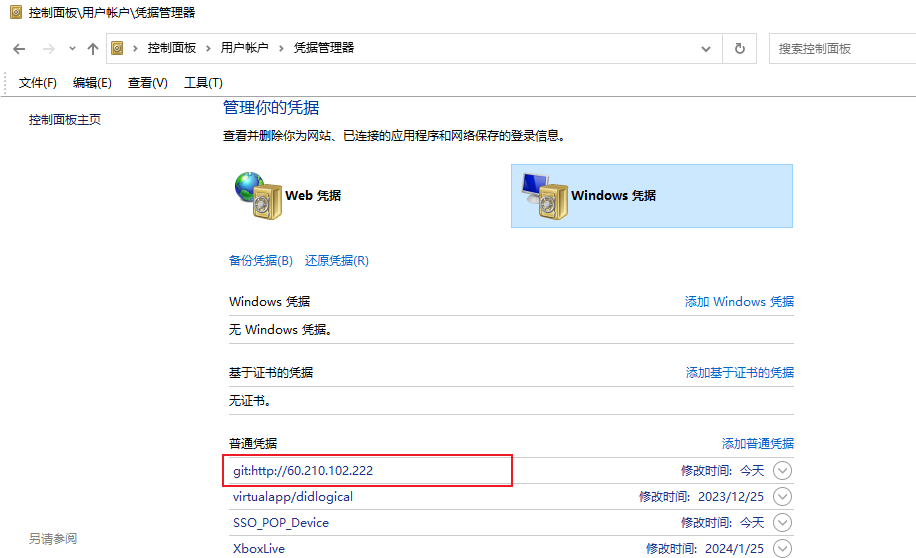

### 设置了权限但是还是无法操作
首先查看账号是否是对的
```bash
git config --global user.name "your name"
git config --global user.email "your email"
### git clone 时提示需要输入密码
### git config --global credential.helper store
```
如果还是不行,并且这台电脑之前有人用过的话,那么就去控制面板看一下

点开看一下存储的是否是自己的账号,如果不是就编辑修改下