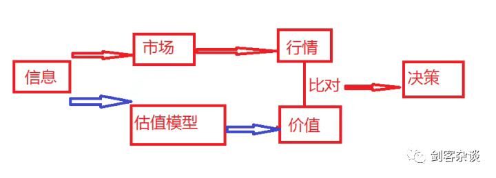
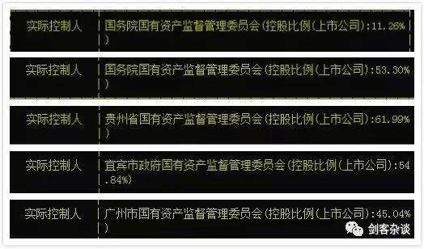
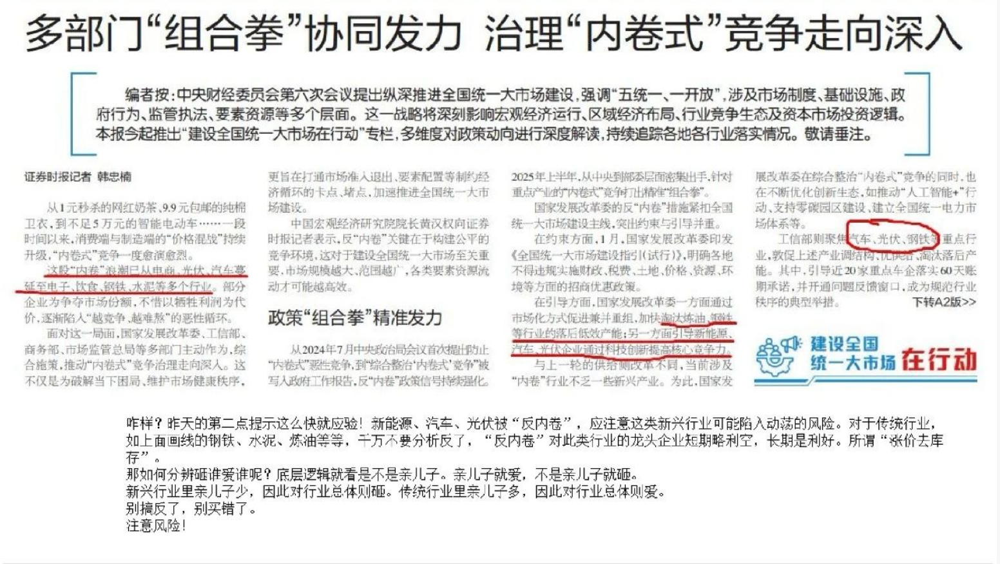
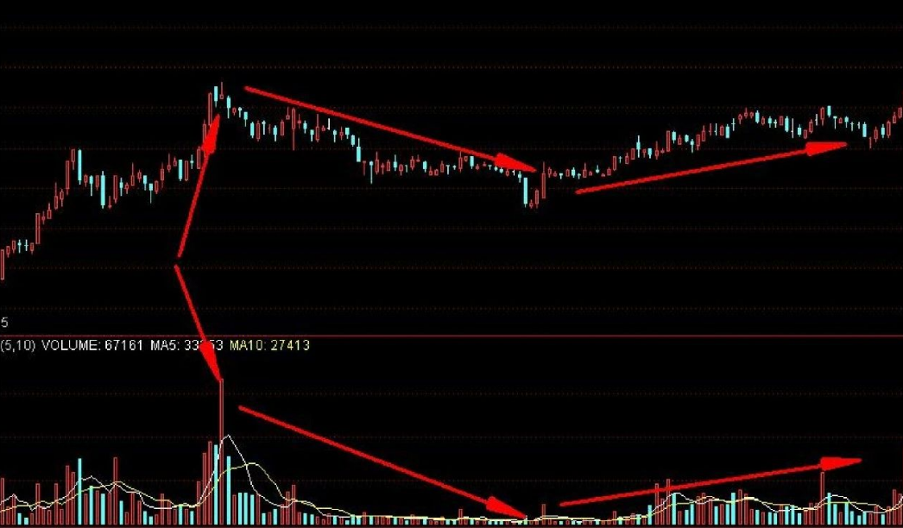

### 判断股票未来大概率上涨的逻辑
- 尽量找上升趋势的股票
- 找到推动上涨的核心因素
- 研究这个核心因素的可持续性
如何找呢,`孙子云:"古之善战者胜于易胜者也!"`
巴菲特便深谙此道，故投资吉列后，喜形于色，夜不能寐，泄露天机曰：“每当我在晚上入睡之前，想到明天早晨全世界会有25亿男人不得不剃须的时候，我的心头就一阵狂喜！”

### 基本面真谛
**一、主逻辑主导行情，次逻辑干扰行情**
    何为主逻辑跟次逻辑？
- 主逻辑是事物发展的核心要素，贯穿失误发展变化的始终。
- 次逻辑是干扰事物变化发展的要素，难以长期存在。

主逻辑体现参与者的共同利益，符合自然规律和传统价值取向；次逻辑总是试图颠覆主逻辑，更多体现为情绪与偏见。

**二、交易的本质就是交易主逻辑**
主逻辑可用于选品种、定长短
- 选品种：技术再好不如资源好，在鱼获少的池塘钓鱼技术再好也不会高产；在鱼获资源多的池塘，技术差、装备差都无所谓。
- 定长短：有些公司的主逻辑会变，比如柯达、诺基亚等，这时就需要你对主逻辑进行监控，一旦有变，需要离场。
有些公司主逻辑会延续很久，就可以一直持有
**三、行情演化的基本模式有三：震荡式、泡沫式和混合式。震荡式：行情波浪式推进，不过分偏离主逻辑；泡沫式：行情加速式发展，过分偏离主逻辑；混合式：震荡式和泡沫式的混合体。无法提前预测行情将以何种方式推进，也无此种必要；**
- 泡沫形成的两个要素：1.持续一段时间的赚钱效应；2.改变用途的资金不断加入
- 泡沫即将破裂的特征：1.价格远远脱离主逻辑；2.资金流入即将枯竭；3.参与者极度兴奋；4.获利资金暗中离场

**四、最佳开仓点：主逻辑坚实，行情受次逻辑干扰时**
举例：
1. 伊利股份2008年受三聚氰胺事件影响，形成最佳买点。
主逻辑：牛奶是重要消费品，随着生活水平提高，牛奶消费量逐年增加。
次逻辑：三聚氰胺事件。
次逻辑本质是食品安全问题，只要严格监管，及时处理问题，并不构成对主逻辑的颠覆，故主逻辑坚实，形成最佳买点。
**五、最佳平仓点：主逻辑已动摇或者泡沫式接近癫狂时**

### 投资要点
0. 自己选股投资的最终目的是什么？
是要跑赢大盘，要不直接买沪深300或中证500ETF就行了
1. 低估买入此为`安全边际`，不要想着买在最低点，低估可以识别但是是否还会更低估不能判断
像巴菲特说过：`第一条:不要亏损，第二条:记住第一条。`
ps：此处说的不要亏损不是说买了一点不跌、不被套而是强调在低估买入，因为低估不会长时间存在，最后都会估值回归。
2. P = PE * E
优质公司，具备`护城河`，即使估值下跌30%，只要净利润维持15%的增长，持有三年还是一分不亏
3. 分散投资，几乎不可能买一只涨一只，所以要靠组合，靠分散，同一品种股票不要超25%的仓位
假设组合有20只，即使其中两只股票跌幅50%，放到组合也不过5%的损失。
4. 一组股票组合中有几只成功的就能轻松跑赢大盘，随着经验积累，投中的概率会越来越大
5. 只做自己懂的股票，此为`能力圈`
6. 何时离场?
    - 三年不盈利离场，此为大师格雷厄姆的规则；
    - 一旦看错公司基本面，出现重大失误，无论涨跌，立即离场；
    - 公司出现高估离场；
    - 发现更好的投资标的，可以卖出手中的标的买入更优质的标的；

**价投的要点**
- 一般的决策方式是：如果发现市场价格低于估值模型给出的价值，可以考虑买入；反之，可以考虑卖出
- 其实我们可以发现，人为订立的模型必然存在着适用性的问题。换句话说，可能适合对某些公司的评定，也可能不适合某些公司。
**选择模型可以评价的，放弃那些模型不能评价的，巴菲特称之为“能力圈”。**

### 如何挑选股票的几个建议点
1. 党的教导记心头，前赴后继跟党走。
凡是实际控制人带有如下字样的:

2. 民以食为天。 
3. 人吃五谷杂粮哪有不生病的。
4. 贱取如珠玉，贵出如粪土。
5. 买到比买到更低点更重要(低估可以识别,但是未来是否更低不知道)
6. 股票进入低估区应制定合理计划分批买入,对于优质股票应该设置上档价
    解释: 比如15倍是你的低估标准，你预留一倍的空间，此时股票打压到14倍，你可能就进行了第一笔建仓，股票不断下修，你计划中的5批资金，其中有三批分别在14、13.5、13.0倍时顺利买入，接下来，股票在利好刺激下暴涨，居然涨到14倍市盈率，还有两批资金没有入场，你怎么办？
    股价为13PE时，可以设定上档价为14PE。股价飙升到14倍市盈率，此时还是低于你15倍的低估标准的么，所以剩下的两批可以在14倍PE时坚决买入！
7. ROE多年在15%以上。

### 牛市初期股票不涨怎么办?
`以下部分观点仅代表当前市场情况，不代表未来市场情况`
#### 一、注意排除地缘风险
中美贸易战,应该是未来的主旋律,所以要注意与美国有生意往来的公司,比如中概股公司、中资控股美国的公司等
#### 二、注意国内政策风险
其次要特别注意国内的政策风险，比如某某产业又要去产能过剩，某某产业又要集中整治，这些行业的股票就不要碰、不要投。要严密关注相关新闻和消息，一有宏观层面的风吹草动及时做出研判和行动。

#### 三、很狠抓牛根、抓龙头
在排除上述风险后，我们要特别聚焦优质龙头公司。唯有行业中的老大才值得你投资。这就是“牛根”“龙头”。
一个行业上涨，龙头必涨。虽然龙头未必是涨幅的第一名，但涨幅靠前的可能性极大。因此，只要你抓准了行业，买入龙头公司，赚钱确定性是极高的。
牛市初期，未普涨与大涨之前，正是耐心审查或换股的最好时期。
建议普通散户尽量持有优质的、在行业中有重要地位的龙头公司。切莫投资那种投机性强的名不见经传的非龙头公司。
#### 四、如何对待不涨的龙头公司
如果你持有的公司既无地缘政治风险、又无内部打压、同时又是政策性支持行业的龙头公司，那么你应该安心的持股待涨。
股谚云：横有多长，竖有多高。
这说明对于那些长期低位徘徊的龙头股，我们要有十足的耐心。
#### 五、侦测主力的基本方法和买点
**1. 横盘之时，正是解盘之日**
要特别密切关注此类股票蛰伏之时的状态，由此观测主力对这只股票的买卖情况，从而通过解盘，增加我们持股的信心。甚至通过解盘，适时的加大投资。
这里的基本原则是要重点关注涨幅和成交量。

**一看价量配合。**
一般要求上涨放量，调整或下跌时缩量，价量的配合要和谐。和谐体现了主力的控盘度和坚定的信心。
**二找旱地拔葱。**
寻找长期横盘时是否出现过一次或多次出人意料的旱地拔葱式的暴涨放量，之后又归于平静，涨时像疯了似的莫名其妙，调整时像噶了似的无声躺平。
**三观调整谨慎。**
长时间的调整小阴小阳线，在一个狭窄的区间中磨磨唧唧，但忽然有一天盘中出现了暴跌、杀跌，看似极为恐怖，但盘中在某个关键点位就是跌不动，似乎有一股神秘的力量在支撑，而收盘之时或以大阴线收盘，但不破关键点位，或收盘前大反攻留下下影线。
这些都可以看作主力主动洗盘、试盘、调仓的动作。这说明主力只是“假意”调整，不希望跌穿心理价位。

利用以上三招，我们应当很容易侦测到主力活动的迹象了。既然有主力在其中活动，加之该股票又叠加了行业利好和龙头地位，那么好饭是不怕晚的。只需耐心等待即可。

**2.对于准备建仓和加仓的朋友**
除了我之前披露的CUP形态是趋势投资法的重要买点，价投则可以选择以上三招中的调整之时建仓。
一是早已侦测到主力活动，心中有数的前提下，可于盘中杀到关键点位时大胆低位建仓（最好有撕心裂肺的坏消息配合）。
二是早已侦测到主力活动，心中有数的前提下，可于该股极度缩量，并股价处于调整空间下轨时慢慢买入建仓（消息面上处于“狗不理”状态），可以一天买点儿一天买点儿似的操作。
