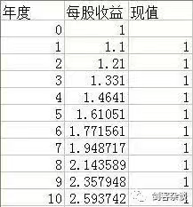
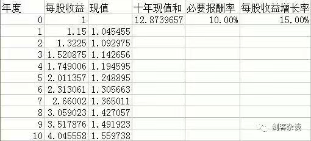
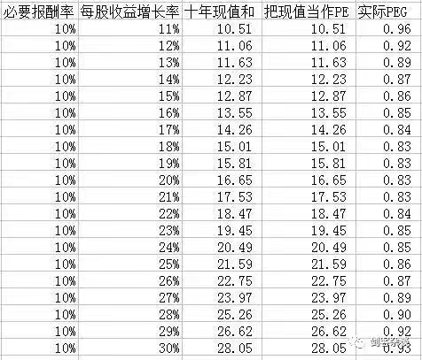

### 极简估值法第一讲
https://mp.weixin.qq.com/s/tfeOJV2qFIooRy_Zm9zUjw
#### 一、极简速判估值怎么判？
很简单。简单到粗暴。
用PEG
PEG=PE/(g*100）=1.0
什么意思？
PE市盈率，g未来收益增长率，PEG为1.0合理估值，大于1.0可能高估，小于1.0可能低估。

**例一**：已知盛京面包股票当前市盈率为50倍，券商等研究机构预计未来净利润增长率为20%，问PEG为多少？是否高估？

解：PEG=PE/(g*100）=50/(0.2*100)=2.5      因为PEG=2.5>1.0，所以高估

**例二**：已知奉天酱油股票，券商等研究机构预计未来净利润增长率为15%，问给多少估值合适？

解：因为当PEG为1.0时为合理估值，故当g=0.15，      PE/(g*100）=1.0，解得PE=15      即奉天酱油给15倍市盈率比较合理

**注意：**
* **a.**    1.0为理想值，不可机械照搬。取1.0是便于计算。一般给予一个区间，比如0.8~1.2都是合理区间，若过分大于，比如2.0，应列为高估，若为1.5，应列为略高估。若为0.3应列为极度低估，若为0.5应为略低估等等。
* **b.**    PEG法为简便算法，方便快速计算，明显的高估低估可以立判 ! 适用于在大量股票中快速选取明显高估低估标的。
* **c.**    如果拘泥于此法，不知道变通，不知道用多种方法印证估值的高低，将作茧自缚。
* **d.**    对于g的取值，普通投资者可能没有这个能力，但我们可以将这部分“外包”，也就是参考券商的研究报告。至于怎样找到报告呢——电脑软件按F10
* **e.**   不要对未来的增长给予过高的估计，一般g取15%~25%是比较恰当的

#### 二、PEG的推导
PEG指标就相当于投资界的乘法口诀，是一种估值的简便算法。     
      
让PEG指标普及的人非彼得-林奇大师莫属，具体可以参考大师的三本书。其中有更加详细的运用方法。
      
但是遗憾的是，对于PEG指标的推导，大师的书里没有。我之前查阅了很多文献，真是云里雾里搞的非常复杂，还有很多参数，我相信，这一定离大师当年的初衷很远。

我经过多年的思考和积累，总结出了一种PEG的推导方法。自认应该和大师的初衷较为吻合，并且推导过程易于被人接受。在此分享出来，抛砖引玉。

> **PEG=1.0为合理估值时的推导：
PEG=1.0 为合理估值，其隐含的条件是必要报酬率为10%PEG=1.0是从股票回本快慢的角度做为参考。**

必要报酬率为10%，相当于市盈率PE为10倍。

PE的意义是将资产投入股市，股市产生收益回本的年限。如市盈率为10，代表10年可以回本

如一只股票第0年每股收益是1元，当前股价是10元，必要报酬率是10%的情况下，未来十年每股收益为，如图：

当必要报酬率为10%时，贴现率等于必要报酬率，所以每年的每股收益的现值皆为1元，显然经过10年的积累，可以将10元股价赚回，也就是10年回本。
此时的PEG=PE/(g*100）=1.0

如果一只股票的每股收益增长率大于必要报酬率10%，那么显然，如果PE仍然为10，回本期将小于10年。**那么这只股票从回本快慢这个角度来看是更好的投资标的。**
同理，如果一只股票每股收益增长率小于必要报酬率10%，那么显然，如果PE仍然为10，回本期将大于10年。**那么这只股票从回本快慢这个角度来看是不好的投资标的。**

**如果一只股票每股收益增长率大于必要报酬率，显然我们对其市盈率的容忍度会大于10倍。**
换句话说，当每股收益增长率大于10%时，**我们应该给多高的市盈率是与10倍市盈率是等效的呢？**
如下图，经过计算和统计，比如当每股收益增长率为15%时，贴现率取必要报酬率10%，十年的现值和为12.87元。也就是说，当假设股价为12.87元时，PE为12.87倍，在15%每股收益增长的情况下，10年刚好回本，此时PEG=0.86，接近1.0。
**与之前的10倍市盈率，10年回本刚好等效。**

如下图，我统计了每股收益增长率11% ~ 30%的情况，发现在贴现率取必要报酬率10%的情况下，十年每股收益现值和与每股收益增长率g的100倍近似，若把现值和当作该情况下的PE，那么PEG在0.83 ~ 0.96之间波动，非常近似于1.0

也就是说，当必要报酬率为10%，PEG在1.0左右，经过十年，股票的每股收益现值和可以大体上保证回本，与10倍市盈率的情况等效。      
同理，当PEG小于1.0时，比如0.6时，不需要10年即可回本，是一个好的投资标的。当PEG大于1.0时，比如1.5，那么显然需要10年以上才能回本，不是一个好的投资标的。
#### 三、基础知识解析
##### 1.必要报酬率：
必要报酬率是什么概念呢？简单的来理解，就是股市整体的平均收益。比如，当前中国的无风险利率大约是3.5%左右，也就是您把钱买了货币基金，大约能获得的收益，而股票是一个风险明显很大的投资品种，所以如果给你3.5%的收益你会去投吗？傻瓜才会呢！

那么就需要给你在3.5%的基础上加一个风险的补偿，对于股市来讲给5%~8%的风险补偿是比较合理的。为了方便，同时综合历史的股票收益，给10%的必要报酬率是较为合适的，同时，这个数值也比较易算。       

想要继续深入的朋友可以学习CAPM资本资产定价模型，参考博迪《投资学》
##### 2.把必要报酬率当作贴现率
如果您冒着风险把一万元投入股市，那么第二年您应该获得多少收益呢？上面提到了必要报酬率是10%，显然平均来看您应该得到一万一千元才是合适的。

那么反过来说，第二年您在股市中的一万一千元，相当于第一年的多少钱呢？答案是：10000元。怎么算的？用11000/（1+10%）=10000；同理您在股市中投了三年，资金达到13300元，这个钱相当于您最初的多少钱呢？ 答案是10000元，怎么算的呢？13300/（1+10%）^3=10000

*这里的10%就是收益率的逆运算，叫做贴现率。*

也就是说，你参加股市这种高风险的投资，如果投了一段，市场没有给你必要的补偿，资金没有增长，那就是在赔钱。 也就是说，未来你看似很多的钱只要除以一加贴现率的几次方（有几年就是几次方），得到的就是你未来的钱相当于现在的钱，到底是多少。这种未来的钱，贴现到现在，叫做现值

##### 3.PE是收益率的倒数，PE的意义是几年回本
因为PE=P/E，即市盈率=股价/每股收益，将市盈率倒过来：1/PE=E/P，每股收益除以股价是什么意思呢？就是股票的收益率，也就是说一只股票10元，每股收益1元，你花10元可以得到1元的收益，这个收益率为10%

可见，PE是收益率的倒数。      
那么当必要报酬率是10%时，市盈率为PE=10倍      
那这个10代表了什么呢？
我们假设一只股票当年每股收益是1元，当前股价是10元，PE10倍，必要报酬率是10%

*可见，未来每股收益将为1.1元，1.21元，1.331元~直到第十年为2.59元（1+10%）^n（n为投资年限），而1.1元，1.21元是未来的钱，还需要贴现回现在，而贴现率刚好也是10%，那么每年的现值都是1元。*

所以，这只10元的股票，经过十年每股收益的积累，刚好收回本金。市盈率10，代表10年回本。
##### 习题：
1.已知某股票当前市盈率为10倍，券商等研究机构预计未来净利润增长率为20%，问PEG为多少？是否值得关注？

2.你的股票经纪人向你反复推荐一只股票，而你发现这只股票当前市盈率高达80倍，从PEG指标考虑，请问你是否会买入？理由是什么？

3.（扩展题）上面推导了，当必要报酬率为10%这个条件下，PEG=1.0为合理。那么请问，如果必要报酬率为8%的情况下，PEG为多少是合理的？

