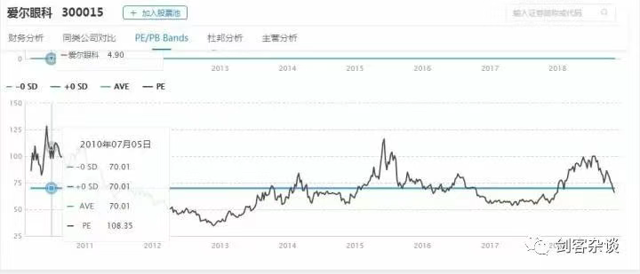
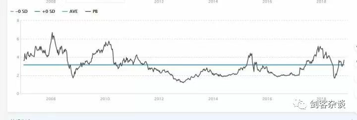

### 极简估值教程——第三讲 安全边际
https://mp.weixin.qq.com/s/B2atQh1xTqzeuAKhjVXFgA
#### 一、决定股票价格的因素及其推论
**公式  P=PE * E**   （为简化，忽略分红等因素）
股价等于市盈率乘以每股收益
P股价
PE市盈率，估值，市场决定，情绪主导
E每股收益，价值，公司决定，价值主导
故而可以将股价分解成两个因素：情绪与价值
**推论：**
设每股收益年化增长率为g
建仓时：P1=PE1*E1
持仓n年：P2=PE2*E1*(1+g)^n
故持有年化收益为：

当PE2=PE1时，股票年化收益率刚好等于每股收益增长率
当PE2>PE1时，股票年化收益率大于每股收益增长率
当PE2<PE1时，股票年化收益率小于每股收益增长率

**可见，持股n年的年化收益率仅与在这个过程中建仓和持仓n年时的PE变化率、每股收益年化增长率g有关，与其他因素无关。**
#### 二、利用均值回归预计未来收益率

如图，我们可以发现市盈率在围绕着均值在上下波动。这种高于均值倾向于回复均值，低于均值也倾向于回复均值的现象叫做均值回归。
我们可以利用估值的这个特点，结合上面的推论来估算股票未来的收益率。

**例一、** 已知奉天眼药股票当前的市盈率为10倍，通过观察历史估值图该股市盈率均值为20倍，经过参考多份券商研究报告，券商给出的每股收益未来三年的增长率为20%，请问三年后如果该股市盈率回归均值，该股的年化应收益率为多少？

答：该股市盈率回归均值，代表市盈率由10倍上升为20倍，故利用推论公式

可得，持股三年的年化收益率为：((20/10)^(1/3))*(1+20%)-1=   51.19%

**例二、** 已知条件同例一，请问：
1.如果该股三年后市盈率达到30倍，年化收益率为多少？ 
2.如果该股三年后估值仍然没有回归均值，估值仍为10倍，请问年化收益率为多少？

答：
1.该股市盈率由10倍上升为30倍，故利用推论公式

可得，持股三年的年化收益率为：((30/10)^(1/3))*(1+20%)-1=   73.07%

2.若三年后仍为10倍市盈率，说明市盈率无变化，引用推论:
"当PE2=PE1时，股票年化收益率刚好等于每股收益增长率"
可知，年化收益率等于每股收益增长率，为20%

**例三、** 已知条件同例一，但该股三年后超过当初券商给出20%的增长预期，实际情况是每股收益增长率为30%，请问，如果三年后如果该股市盈率回归均值，该股的年化应收益率为多少？

答：
该股市盈率回归均值，代表市盈率由10倍上升为20倍，“实际情况是每股收益增长率为30%”说明g为30%，故利用推论公式

可得，持股三年的年化收益率为：((20/10)^(1/3))*(1+30%)-1=   63.79%

**例四、** 已知条件同例一，但该股三年后未达到当初券商给出20%的增长预期，实际情况是每股收益根本没有增长，请问：
1.如果该股三年后估值仍然没有回归均值，估值仍为10倍，请问年化收益率为多少？
2.如果该股三年后市盈率回归均值，年化收益率为多少？
3.如果该股三年后市盈率达到30倍，年化收益率为多少？ 
4.该股三年后市盈率在多少时，年化收益将为负值？

答：
由“实际情况是每股收益根本没有增长”可知g为0故利用推论公式

可得：
1.年化收益为:    ((10/10)^(1/3))*(1+0)-1=  0
2.年化收益为:    ((20/10)^(1/3))*(1+0)-1= 25.99%
3.年化收益为:    ((30/10)^(1/3))*(1+0)-1= 44.22%

4.引用推论：“当PE2<PE1时，股票年化收益率小于每股收益增长率”，可知，当三年后市盈率小于10倍时，该股的年化收益率为负值。

#### 三、 安全边际
通过以上例题的计算，我们可以发现很有趣且令人兴奋的结论。

1.如例题一中，当股票估值低于估值均值时，如果这时候买入，未来三年估值回归均值，那么年化收益将远远高于实际的每股收益增长率g，实际增长率为20%，而由于估值回归，年化收益将高达51.19%！！
再如例二中，如果估值不仅回归，还高于均值的话，那么年化收益将更加惊人，为73.07%！

2.如果不仅估值能够回归，而且每股收益还同时增大的话，年化收益将远远大于单纯的估值回归，如例三中年化收益高达63.79%
在投资中，将估值和每股收益增长的双重提升叫做：戴维斯双击。

3.即使每股收益增长率g根本不如预期，如例四，只要估值能够提升，那么年化收益率将仍然为正！
只有在未来估值减小的情况下，年化收益才为负。换句话说，只有估值不往上变而往下变的时候，我们才可能赔钱！！

如上表，是当前市盈率为10倍时，未来三年g的三种情况与估值变化对应的年化收益的统计。我们发现只有在估值极度萎缩的时候才有亏损的可能，比如表中的市盈率为5倍时，其余情况年化收益都不小于0

可见，低估值买入真的是好处多多啊。

我们只要买入时的估值很低，往下变的空间很小，同时往下变的概率就很小，那么最终赚钱的概率将大大增强！

这种低估买入，使得估值向下空间很小，赔钱概率很低的投资理念，就是投资大师格雷厄姆、巴菲特、约翰聂夫等人反复强调的“安全边际”四个字的由来！！

**习题**
1.已知奉天鸡架股票当前市盈率为30倍，假设未来6年每股收益增长率为15%，请问第六年末市盈率为多少时，你既不赚钱也不亏钱？

2.你的股票经纪人向你反复推荐长生健康这只股票，并向你发送了该券商最新的研究报告，报告显示预估该股未来三年增长率为25%，但你学了盛京剑客的教程后多了个心眼，观察了该股的历史估值情况。你发现该股市盈率均值为30倍，而当前估值为65倍，历史最低估值为15倍。
请问，这只股票是否具备安全边际？

3.（扩展题）请观察这一讲的这张表格

如上表，是当前市盈率为10倍时，未来三年g的三种情况与估值变化对应的年化收益的统计。
我们假设未来三年增长率：符合预期、超预期、不及预期发生的概率分别是50%、25%、25%；第三年末市盈率为30倍、20倍、10倍、5倍发生的概率分别为20%、50%、20%、10%，
请问：
1.该股年化收益的期望值为多少？
2.你通过研究，发现了10只与上述股票类似的股票，你老婆说应该10只都投，你却说买一只就可以了，请问谁的观点更合理，为什么？

#### 上一讲习题解答：
1.已知盛京剑客先生于2018年6月开始清仓了恒瑞医药和爱尔眼科。请您结合这一讲的内容并查阅相关股票历史估值，谈谈他卖出的原因可能是什么？
答：截取恒瑞医药与爱尔眼科历史估值图可见

6月份时，两只股票估值都接近历史估值最高位，形成明显的估值高峰，恒瑞医药更是超过了2007年疯狂大牛市86倍的估值，达到89倍，这时候不跑，难道等待斩首示众吗？！

2.已知盛京剑客先生于于6月26、27、28三天分批建仓中兴通讯，并以18.80元卖出离场。除了他对基本面的研究外，你觉得还有什么原因使得他敢于连续跌停后入场？
答：由于当时中兴通讯每股收益为负，故PE也为负值，无很好的参考价值。所以参考市净率历史图表，如下

发现当时市净率为1.70倍，小于2016年的低点，略小于2008年金融危机的低点，对于一只科技股来讲，尤其是第二大通讯设备商来讲，给予这样的估值应是极度低估。加之基本面，政经面绝不可能允许该股倒下，故大胆买入。待反弹后轻松获利45%离场

3.下图是上证和深证A股的历史市盈率。当前，管理层利好频出。官方认为，中国股市具备投资价值。
但有些别有用心的买办媒体和境外势力反复宣扬中国崩溃论，中国股市续跌论，很多无良小号仍然叫嚣，准备继续做空。

请你结合这一讲，来谈谈中国A股的估值情况。到底谁说的对些？

答：根据上一讲历史估值的参考与运用，用屁股都能发现当前沪深A股处于历史估值低位。再结合这一讲的安全边际。中国股市极具投资价值的结论成立！
“有些别有用心的买办媒体和境外势力反复宣扬中国崩溃论，中国股市续跌论，很多无良小号仍然叫嚣，准备继续做空。”用屁股都能想明白的问题他们都视而不见，说明这些人确实别有用心，无非是用唱空想捡便宜筹码罢了。

4.根据这一讲的“低估的不传之秘”，你能找出几只你认为已经接近历史低估的股票吗？答：略