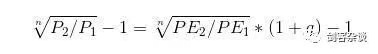
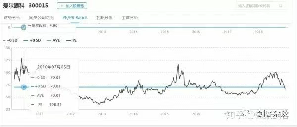

### 极简估值教程——完结篇 价值投资系统建构举隅
https://mp.weixin.qq.com/s/cJeP76ZRXlRm_YwM8nn-2A
前面几讲本来愿望是写“极简”，由于本人水平十分有限，加之投资本身就是一个极其精妙的思维集合，想要简化，但又要表达，只能索性写的具体些了。也许以后能有机会重安个题目，现在怎么看怎么不切题。算了，先不说这些。还是来说投资。

今天我把之前三讲的内容做一个整合，根据上面三讲的内容为思路，其实已经可以勾勒一个价值投资系统的构架了。

其实任何一种思路，一个核心，一个侧重就足以构建一个交易系统。关键是你进行深入的思考，研究，实盘中获得心得体会，这些都可以加入你交易系统中。

过程嘛，很像我们小时候搭积木。你可以参考大师的交易系统，哪块积木合适，你也可以用，哪块积木你不喜欢，你就不用啊。但前提是：你得能看懂大师的东西，知道好在哪，为什么这样设置。

有些人固执己见，玩了几天K线就全盘否定价值投资，你连了解都不肯不了解，你的否定只能说明你很幼稚啊。

随着你的交易系统不断完善，也许你真的能独创一套独步股林的降龙十八掌呢！

今天的题目叫《价值投资系统建构举隅》，举隅便是举一个例子，目的是引发各位朋友的思考，如果您这也要，那也往里装，那您是贪心发作了。

**好了，我废话太多了，下面直接干货伺候了：**

**基于预估收益率的价值投资系统举隅**

#### 一、变量
- 1.g；
- 2.PEG; 
- 3.目标预估收益率；
- 4.卖出预估收益率；
- 5.组合中股票数量；
- 6.行业数量；
- 7.行业最大股票数量 ；
- 8.n ;
- 9.g可信值

#### 二、决策公式与工具：
- 1.PEG=PE/(g*100）
- 2.

- 3.市盈率历史图，可登陆“萝卜投研”查找，最近他们改版了，以前很好看的股票走势和PE同列的图没有了，据说今后会恢复。当然您也可以查找别的网站，当前这种资料很多的。

#### 三、参数
***（为了便于说明，我先设定一些初始参数，但不一定合理。您可以根据自己的情况来自由选取）***
- 1.g>10% (根据券商未来三年预估)
- 2. PEG<1.2；
- 3.目标预估收益率>35%；
- 4.卖出预估收益率<=0%；
- 5.组合中股票数量:20只；
- 6.行业数量：10个行业；
- 7.行业最大股票数量：5只；
- 8. n取3年，是决策公式中的n
- 9.g可信值<=35%,（有时候市场极端热络，券商可能给出过于乐观的增长估计，比如认为未来三年年化增长为80%，若不及预期，后果将十分严重。别人疯狂，我不疯狂。这里设定35%，即若大于35%，则一律取35%）

#### 四、买入条件
- 1.PEG<1.2；
- 2.目标预估收益率>35%；
- 3.当前市盈率必须小于等于历史均值；
- 4.g>10%(根据券商未来三年预估)
- 5.组合中股票数量:不大于20只；
- 6.未超过行业最大股票数量5只；

#### 五、卖出条件
- AB任意一个发生即卖出
- A.基本面变坏
- g<10%(根据券商未来三年预估)
- B.个股处于极端高估或未来预估收益率降低
- 卖出预估收益率<=0%；

#### 六、换股条件
- 1.换入标的与换出标的目标预估收益率之差>35%；
- 2.换入标的应满足：    
    2.1.PEG<1.2；    
    2.2.目标预估收益率>35%；    
    2.3.当前市盈率必须小于等于历史均值；    
    2.4.g>10%(根据券商未来三年预估)
- 3.换股后应满足：    
    3.1.组合中股票数量:不大于20只；    
    3.2.未超过行业最大股票数量5只；

#### 七、资金管理
1.资金平均分成20份，你设定的组合股票数量是几就分几份；

2.行业数量设置为10，即代表只在10个行业中选取，每个行业最多5只。当不满足买入条件时，有的行业可能0只。选出你最满意的20只股票。如果当时股市整体业绩不好，或处于极度高估期，有可能选不满20只，比如只选出8只，那就有12份资金空仓。

3.定期再平衡，比如定期半年或一年再平衡一次。用总资产除以20份求得当前每份资金量，卖出部分占用资金高的个股，买入部分占用资金低的个股，使得每份资金接近当前每份资金量。

#### 几点说明
##### 1.预估收益率
使用公式2计算，这里n取3，因为一般的券商报告是给出未来三年的复合增长预期的。

比如某股当前的市盈率为10倍，通过观察历史估值图该股市盈率均值为20倍，经过参考多份券商研究报告，券商给出的每股收益未来三年的增长率为20%
可得，持股三年的年化收益率为：((20/10)^(1/3))*(1+20%)-1= 51.19%

这时预估收益率就是51.19%，大于35%

同时该股PEG=0.5，g=20%，符合买入条件，故该股可以考虑

##### 2.卖出
反之，如果预估收益率小于设定的参数0，那就达到卖出条件。比如
[对高估值医药股要谨慎](https://mp.weixin.qq.com/s/8T5VWH-2f30IFdQr5iLPvw)
这篇文章中分析的恒瑞医药
> 如牛股恒瑞医药600276，公司当前运营正常，多款创新药逐渐兑现，故未来业绩增长确定性较高。根据多家机构的报告，未来三年22%的复合增长应属大概率。但是，当前PE（TTM）已高达86倍，与2007年投机泡沫时期相当。而该股平均PE为45倍左右，存在回归均值的可能。这样的未来三年的复合增长率为： (（45/86）^0.333)*1.22-1=-1.69%

如果按照设定的：卖出预估收益率<=0%；那就应该做卖出处理！就这么简单！

##### 3.关于参数的设定
因为我们是在估值，既然是“估”就存在错误和不确定性，所以我们在允许的范围内要“夸张”一些，这样会更符合预期。对于股票最好“严进宽出”。
就像你高考680分不一定能上清华，但你考了750分一定能上清华。选股要严一些。比如设定目标预估收益率>35%，这就是一个较高的标准，可以剔除很多劣质股。

对于持有的股票要“宽大”一些。如果卡的过严，一方面可能会频繁的买入卖出，一方面容易将大牛股轻易脱手！！比如持有的某股未来预估收益率10%，你觉得低就卖掉了，这很可能错失大牛股，因为你的10%不是精确数字，而是“预估”。
如卖出预估收益率<=0%，这就是一个较为“宽大”的参数，只要股票没接近这个值，基本面又很好，就可以长期持有。
这里的参数只是举例，你可以根据自己的需要变换参数。

##### 4.换股
换股是一个较高难度的操作！！
除非当前持有的股票实在令你寝食难安，想换入的标的实在令你早思暮想，否则不要轻易尝试！（当然，如果持有的股票基本面出现问题，那是另外一回事）

想要仔细分辨某只股票一定好过另一只股票，这难度可是非常非常高的。就连股神巴菲特在换股上也是错误连连！比如早年巴菲特清仓盖可保险换入西方保险，后来盖可涨了80多倍，巴菲特悔的肠子都青了！

那么您要是非换不可，就像前面讲的，一定要“夸张”一些，留足余地，因为是“估值”。

所以我设定：换入标的与换出标的目标预估收益率之差>35%；

也就是说，如果你当前持有的标的预估收益是10%，而你准备换入的股票预估收益是40%，那你就不应该换！因为40%-10%<35%
只有大于35%时你才能换，必须有非常明显的好处的情况下才能换，避免你冲动的瞎搞

##### 5.交易系统设计思想
我们的交易系统要能最大限度的体现并实现我们的理念。

比如这个价值投资系统就是基于前三讲的内容：

买入低估+成长，具备安全边际的个股。长期持有优质股，给优质股充分的发展空间。卖出高估、成长萎缩的个股。当新标的远远优于持有标的的时候酌情换股。然后适度的依靠行业分散、单行业最大股票上限、多只股票组合来分散风险。

我们设定的交易规则很好的满足了上述要求，并且很简单，易于操作。

同时当市场极度低估，并且某些业绩较好的股票是可以被该系统捕捉到的。当市场极度高估，人们疯狂的时候，我们保持冷静，特别设定了g可信值<=35%，不随他们疯狂，某些涨幅可观的股票会在高位抛出。如果没有低估的标的，我们系统选择了部分空仓，从而在行情的回拉中保住利润。

**你会发现，即使我们不使用技术指标，不参考大盘走势，我们仅仅利用个股的估值和相应的价值指标，一样也可以做到高抛低吸，而且上涨行情持有的更久，心态更好。这与波段操作是殊途同归的，技术派们切莫固步自封，坐井观天哪！！**

我在这里只是举例，目的是抛砖引玉。上述系统的参数和设置您可以根据自己的偏好来调整，您也可以修改其中的规则，或者添加您认为适合的系统和方法。

《极简估值教程》今天就结束了。祝大家今后投资生涯顺利
