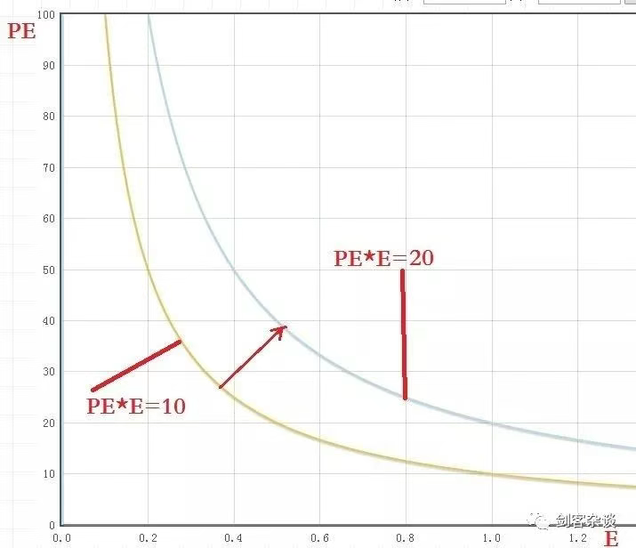
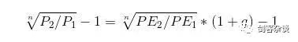
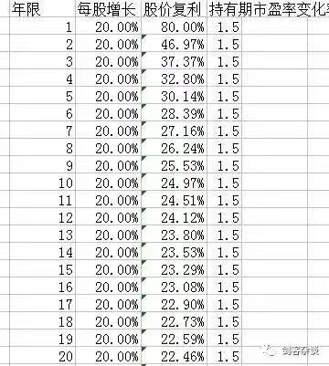
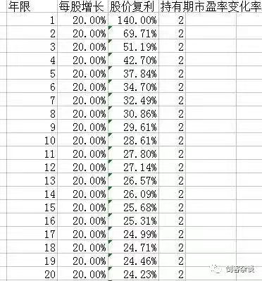
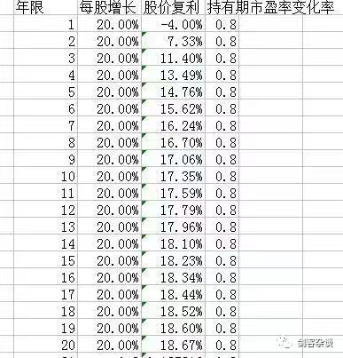
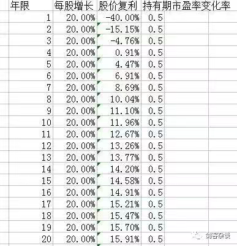

## 本文转载自：盛京剑客
### 用一个公式彻底讲透股票投资
https://mp.weixin.qq.com/s/8Pdvj5SAmfcHfTJHiOLtGw
新年伊始，万象更新。希望2018年的第一篇文章能让您有些许收获。预祝大家2018年投资顺利，账户长阳。欢迎讨论、留言。
话说，真传一张纸，假传万卷书。
我向来不喜欢云里雾里，半天挤不出一个偏屁的人，咱还是直击本质，废话少说直接上公式
##### 一、公式
 `P=PE*E`
股价等于市盈率乘以每股收益
* P股价
* PE市盈率，估值，市场决定，情绪主导
* E每股收益，价值，公司决定，价值主导

故而可以将股价分解成两个因素：情绪与价值 
基于两个因素，有不同的侧重即为投资与投机的差别
依靠公司价值为主作出决策的即为投资
依靠市场情绪为主作出决策的即为投机 

##### 二、如图

由公式可见，当股价为一定值时，PE=P/E，因此PE与E的图像是双曲线中的一条。就如图中所画。如股价为10元时，可以是10倍市盈率，1元每股收益；也可以是50倍市盈率，0.2元每股收益。

现在股价如果要涨到20元，就需要曲线向右侧移动。显然，曲线的右侧代表的是股价上涨的区域，而曲线的左侧显然是股价下跌的区域，在曲线上就是股价不变的区域。由图可知，想要股价上涨，落到曲线右侧区域，无非以下组合
* 1.PE不变    E变大
* 2.PE变大    E不变
* 3.PE变小    E变大+
* 4.PE变大    E变大
* 5.PE变大+   E变小

##### 三、推论
设每股收益年化增长率为g建仓时：P1=PE1*E1持仓n年：P2=PE2*E1*(1+g)^n故持有年化收益为：

可见，持有股票的年化收益率与建仓和持仓时的PE变化有关，与每股收益年化增长率g有关。

* 当PE2=PE1时，股票年化收益率刚好等于每股收益增长率
* 当PE2>PE1时，股票年化收益率大于每股收益增长率
* 当PE2<PE1时，股票年化收益率小于每股收益增长率

##### 解析
###### 1.投资与投机
对于一个成熟的市场，市场的管理者、投资者与上市公司属于较为理性的群体。在这样的市场环境下，对于股票的估值往往比较适度，虽然可能阶段性的出现情绪低落抑或情绪极为亢奋的状态，但发生的频次十分有限。

这样的市场对于股票的估值较为合理，虽然低估和高估时常出现，但不会过分的离谱。因而，对于估值的指标PE市盈率来说整体波动并不十分剧烈。

那么根据公式P=PE*E，在这样的市场中，很难依靠PE的大幅波动来获得超额利润，或者换句话来说，PE没有给投资者太多的投机空间，因此在这样的市场中分析公司的价值成为了投资的主流。这也就是为什么在美国这种市场中，价值投资是主流的原因之一。

反之，对于一个非理性的市场，情绪成为这个市场的主导。人们的预期、管理层的干预、上市公司的黑幕汇成一条非理性的河流，涤荡着投资者的情绪。比如公司的业绩没有什么变化，但市盈率却像脱缰的野马从10倍猛涨到100倍，又从100倍跌到20倍。有的公司连年亏损，但一改名，股票的市盈率居然也从10倍直逼50倍。

可见这样的市场无法对股票有一个合理的估值，也就无法体现出公司的价值。

由于PE的大幅波动，给了投机者宽阔的“战略纵深”，有了更多的闪展腾挪的机会，低买高卖，波段操作，抄底逃顶，是应对这类市场的基本战术。因此依靠市场情绪做投机更适应这类市场。

###### 2.不同流派与其获利路径
前面提到，想要股价上涨，落到曲线右侧区域，无非以下组合
* 1.PE不变    E变大
* 2.PE变大    E不变
* 3.PE变小    E变大+
* 4.PE变大    E变大
* 5.PE变大+ E变小

对于价值投资来讲，主要侧重于公司基本面的分析，他们对于PE的态度，也就是对市场情绪的态度，是采用“保守主义”。即：请你别伤害我。

故而价值投资希望估值尽量低一些，这就是安全边际的由来，这一派以格雷厄姆为代表。他们主要依靠的获利路径是2，即选择烟头企业，股票低估，今后每股收益变化并不大，依靠PE回归正常估值来获利。

巴菲特早年复制的是格雷厄姆捡烟头的投资法，后来看到飞利浦-费舍的书，加之与查理芒格合作，投资哲学有了较大变化，讲究以合理的估值买入优质的企业。更加侧重于E的持续变大。他们依靠的路径主要是1、3和4，其中更加注重1这个路径，如果在出现4，PE过大时，他们可能认为估值过高，会逢高卖出。当然，彼得林奇也属于这一派。

投机者是直接依靠市场的情绪作出决策，至于以上5种路径他们是照单全收，只要股票涨了就行，不去管太多。用趋势投资的话说就是：买的高，卖的更高。

对于投机来说，流派实在太多。如著名的博傻理论，俗称割韭菜。著名的擦鞋匠理论，即擦鞋的都开始谈论股市了，就是见顶的时候了，2015年连保洁阿姨都谈论股票的时候，你就该和股市说拜拜了。至于K线，技术分析更是投机的基础技术，当然要数此列。

在这里索罗斯的贡献不得不提，索爷聪明绝顶，居然创立了反身性理论，认为PE与E的是相互影响的关系，而不是割裂的，随着PE的提升，E也会随着提升，然后E又会提升PE，于是股价水涨船高。

在这里要特别说明的是，投资并非完全不参考情绪，投机也并非完全不分析公司业绩。如价值投资，低估买入，没有市场的情绪，哪来的低估机会呢？同理，没有市场的极端热络，哪来的高估卖出呢？对于投机，不研究公司基本面，不对公司有一个全面的了解，那如何知道该爆炒哪家公司哪个板块呢？

###### 3.能力圈与护城河
***估值提升的好处***
我们从推论可以得出，未来的PE如果和当前的PE一样大，那么年化收益率就等于每股收益增长率g。如果未来的PE增长了，年化收益就大于g。如果未来的PE减少了，那么年化收益就小于g。

假设每股年化增长率是20%，市盈率变化是1.5与2，即当前PE如果是10，那么未来PE是15和20

我们看到在1.5的条件下，如果持有5年，年化收益率是30.14%，持有10年年化收益率是24.97%

在2的条件下，如果持有5年，年化收益率是37.84%，持有10年年化收益率是28.16%

都明显的优于20%的每股增长。这就是估值和成长双增带来的好处。这就是著名的“戴维斯双击”

反之，我们看到在0.8的条件下，如果持有5年，年化收益率是14.76%，持有10年年化收益率是17.35%

在0.5的条件下，如果持有5年，年化收益率仅为4.47%，持有10年年化收益率仅为11.96%

这都明显的小于20%的每股增长。说明即使一个公司保持高速的增长，但建仓时的估值过高，而今后估值降低，将大大的影响持股的年化收益。

如果运气很差，又遇到了g的萎靡，那收益率将是负的无疑

看一看你身边的炒股朋友，是不是都买在了估值高位，仍然在忍受着套牢的痛苦。我说的没错吧？！

可见，估值对于股票收益的影响十分巨大。这也就是价值投资反复强调的低估值的原因。

***稳定的g是长期持股的秘密***
同时，我们看到。由于n次根号下PE2/PE1，当n趋于无穷大时，这一项趋近于1，故而随着时间的延续，估值的影响将明显减弱，股票的年化收益率将接近于每股收益的复合增长率。这就印证了查理芒格说的：“从长期来看，股票的年化回报率和其净利润率的增速大致一致，并且很难超过后者的增速”。

那么一个企业如果能够长期保持g的稳定增长，估值也较为合理，那么如果长期持有这只股票就可以获得和企业利润增速一样的收益。

对于巴菲特这样的经营着保险公司的的投资者，将浮存金投入股市，一方面资本巨大，一方面对增长的确定性要高，这就决定了他的投资风格：稳健赢利，长期持有

因此，寻找稳定g的公司成为巴菲特的投资方向。

那么，什么是能力圈就可以在此解密了，巴菲特的**能力圈就是只投资g稳定的公司**，不稳的不投。护城河也可以解密了，**护城河就是保证公司能获得稳定g的因素**。 

就是这么简单的玩意儿。

我看过很多写巴菲特的书，基本上都是”浑说“！说什么巴菲特当年不投资科技股是因为他不懂得科技，什么保守，尔尔。凡是这么写的，这书就可以撕了，你看了就是在误导你。其实很简单，科技股没有稳定的g，不投，完事了，就这么简单！

***你没有巴菲特的条件，学什么巴菲特？根据自己的条件，走你自己的路***

有些人自称是价值投资者，整天把能力圈、护城河挂在嘴边，在他们的观念里价值投资就得长期持有，永远不卖。

这种人深受应试教育的毒害，养成了遇到某某条件，就用某某公式去套的思维定势。不去分析具体的环境、个人的实力，妄图凭借一种僵化的操作方法，或者号称股神也在用的方法来包打天下。这和当年李德 博古不审时度势，用阵地战妄图“御敌于国门之外”，造成第五次反围剿失败一样愚蠢！

巴菲特的体系是配合大资金稳定盈利这个前提的。资金大有资金大的苦恼。选公司长期持有也是没有办法的办法。

而对于资金小，水平低的散户，你可以借鉴巴菲特，但你没有必要完全复制巴菲特。资金小，船小好调头，具有灵活的优势，何不利用这个优势呢？

人家巴菲特能看十年二十年，具备丰富的经验可以判定企业的价值。然后长期持有。

你没这个能耐又怎么学巴菲特呢？小心画虎不成反类犬！

你看不了十年，但你看个两三年的水平还是有的吧？不行就一年总可以吧？每股收益能成长一年的股票你都找不出来？再加上我上面讲的低估原理。那你一年换一次股，连续十年，不就人为的”拼出“了一个连续增长十年的股票了么？！

再不济，你抄底逃顶，韭菜萎靡的时候你建仓，韭菜高兴的时候你平仓，割韭菜也行啊！！

全文完