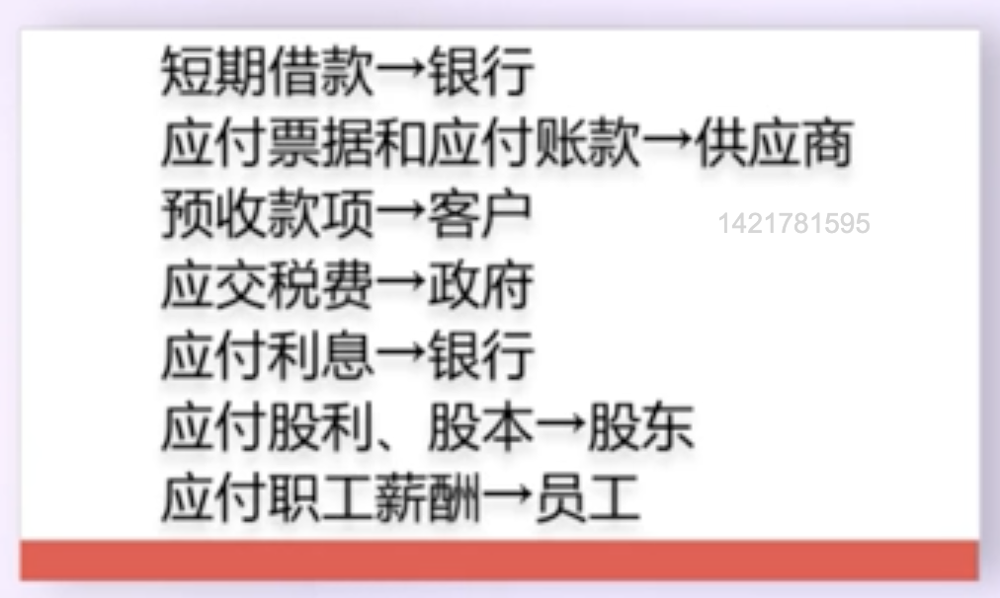

## 资产负债表
资产负债表左边是资产,强调了资源跟结构,资产负债表右边是负债,强调了这些资源属于谁,是谁提供的,它的权益属于谁
资产负债表左边:
`流动资产`:
* 一年内可以转换为货币的资产,如家电类存货
* 一个经营周期内能转换为货币的资产,如房产类资产

`非流动资产`:
* 一年内或一个经营周期内不能转换为货币的资产,如固定资产类资产、投资等

其中又可以分为`经营资产`跟`投资资产`
如何区分呢?对利润的贡献方式或者扩张方式(ps:如果其他应收款很大,大于总资产的1%,那么大概率是像关联方提供的资金)

资产负债表右边:
负债分为`经营性负债`和`金融性负债`
`经营性负债`:
* 跟债权人相关不要利息有关的(往往跟业务有关)
`金融性负债`:
* 要利息的(往往跟发展和扩张有关)

股东权益分为`股东入资`跟`利润积累`

战略接口资产负债表适合大一点的企业(涉及到合并报表的一些知识)

#### 中小企业的资产负债表分析
**一、利润的产生机制(资产负债表左边)**
**如何根据财务报表判断企业定位即企业是干什么的**

**企业是怎么干的**

**效率跟效益**
`效率`是强调对资产的有效利用,产生市场欢迎的产品
`营业总收入/平均总资产`得到的是`总资产周转率`
`效益`是通过资产的有效利用,能够产生理想的利润
`效益`看两方面,
* 第一,`毛利率`
* 第二,`净利润`与`营业收入`的关系

**二、利益相关者的利益问题(资产负债表右边)**
1、给谁干

2、怎么分
* 股东之间,尤其是控股股东跟其他股东之间

**经营资产分析**
`营运资金(营运资本)`:`流动资产-流动负债`(官方)
常规分析方式:
`流动比率=流动资产/流动负债`
一般人认为,传统制造业流动比率最好是2:1,但是需要根据企业具体情况分析
`短期借款的管理问题`:
1、是否必要
2、是否恰当

`其他应收款`:不应该超过资产总额的1%
巨额其他应收款的去向:
1、向子公司提供资金的通道（看合并报表，母公司的`其他应收款` - 合并报表`其他应收款`就是向子公司提供的资金额）
2、为母公司或者兄弟公司提供资金(合并报表的其他应收款异常高,往往是往母公司或者兄弟公司提供资金的重要通道)

## 利润表
什么是利润,收入减去费用就是净利润
凡是能使利润增加的因素或项目都叫收入，凡是能使利润减少的因素或项目都叫费用
`公允价值变动净收益`需要注意一下,啥意思呢,你股票之前10块一股,现在15一股,这多的5块就是,俗称`泡沫`

## 现金流量表
涉及到货币资金和其他项目的一种对应关系的变化,现金流量表一定有影响

